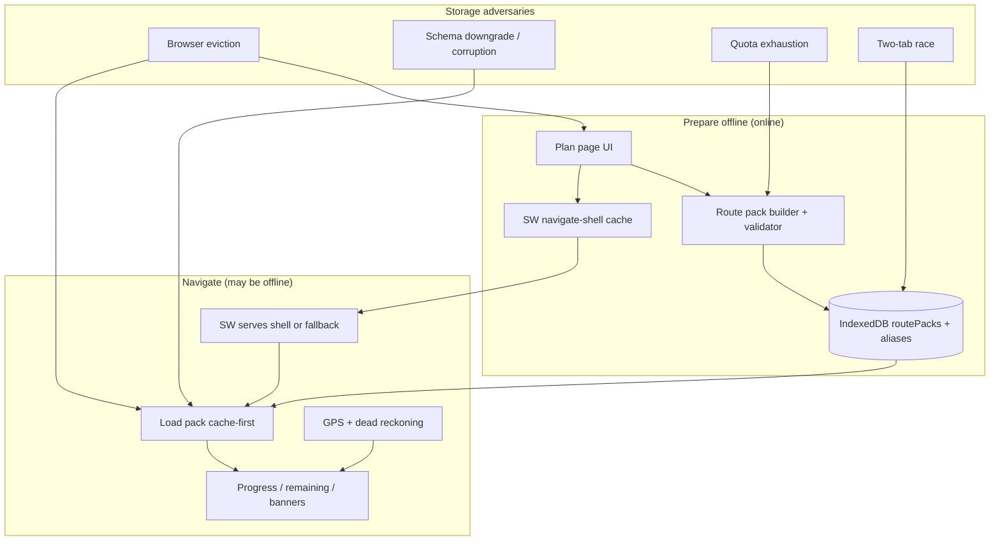

# Offline navigation — adversarial analysis

**Scope:** production build at `http://127.0.0.1:3111`, Playwright probes, and vitest regression tests.  
**Run date:** 2026-08-21 (branch `cursor/offline-nav-adversarial-e207`, base `ee1d13b`).

**Governing principle:** once a route pack is in IndexedDB, navigation must work with no network. GPS errors must not blank the trail. A plausible wrong answer is worse than a refusal.

## Executive summary

| Layer | Probes | Result |
| --- | ---: | --- |
| Cold/warm offline navigate | `e2e/offline-navigation.mjs` | **PASS** (7/7 scenarios) |
| IndexedDB corruption & alias attacks | `adversarial/offline-adversarial.mjs` | **PASS** (24/24) |
| GPS trust & off-trail banners | `adversarial/gps-adversarial.mjs` | **PASS** (6/6) |
| Storage freshness & schema UX | `adversarial/probe-storage-browser.mjs` | **PASS** (8/8) |
| JSON fallback & point queue | `adversarial/probe-storage-local.mjs` | **PASS** (6/6) |
| Weather stall during pack save | `adversarial/probe-storage-weather-stall.mjs` | **PASS** (1/1) |
| API ownership & bounds | `adversarial/api-probe.mjs` | **PASS** (16/16) |
| Concurrent writes | `adversarial/retest-concurrency.mjs` | **PASS** (50/50 retained) |
| CSP / map shell | `adversarial/csp-check.mjs` | **PASS** |
| Unit regressions | `npx vitest run` | **PASS** (702 tests) |

All previously documented critical offline findings (alias pointer mismatch, cache poisoning, stale “saved” UI after eviction, silent JSON fallback overwrite, unbounded point queue) are **fixed and verified** by the probes above.

## Attack surface



### 1. Route pack integrity (IndexedDB)

**Threats:** truncated geometry, swapped lat/lng, non-monotonic distance index, epoch `cachedAt`, 50 MiB GPX blob, alias pointer to another canonical pack, orphan alias with no payload, duplicate alias writes, quota during alias put.

**Held:** every corrupt pack scenario in `offline-adversarial.mjs` surfaces an explicit “Cannot navigate offline … Retry” screen — no white screen, no silent wrong route. Alias/payload mismatch is rejected. Quota during alias write leaves **no** orphan pack (`pack=false, alias=false`) and shows honest UI.

**Evidence:**

```
PASS alias/pointer-payload-mismatch/rejected
PASS quota/synchronous-alias-failure-atomic — {"installed":true,"aliases":0} state={"pack":false,"alias":false}
PASS orphan-alias-refused
```

### 2. Service worker & cold start

**Threats:** poisoned navigate-shell cache, cache deleted mid-session, first-ever offline open without prior warm visit.

**Held:** poisoned shell degrades to app home / explicit “navigation screen was not saved” message, not arbitrary HTML execution. Cold-start B3 loads HUD from cached shell + IDB pack with network fully offline.

**Evidence:** `e2e/offline-navigation.mjs` B1–B3; `sw/cache-poisoning-degrades-safely`, `sw/cache-delete-offline-fallback`.

### 3. Storage freshness (eviction without events)

**Threat:** pack evicted while plan page still shows “Route pack saved”.

**Fix:** `prepare-offline.tsx` and `offline-readiness.tsx` revalidate on `focus`, `pageshow`, and `visibilitychange`.

**Evidence:**

```
PASS eviction-live-ui-claim — initial=true; safe-after-eviction=true; button="Prepare offline"
```

### 4. Schema mismatch UX

**Threat:** app downgrade or damaged DB yields raw `VersionError` / missing object store jargon.

**Fix:** `formatOfflineRouteStorageError()` maps storage failures to actionable copy; navigate page uses it.

**Evidence:**

```
PASS schema-higher-version-visible-error — "... incompatible, or damaged saved-route database ... re-download ..."
PASS schema-missing-stores-visible-error — same pattern
```

### 5. GPS trust during offline HUD

**Threats:** teleport, frozen fix, null island (0,0), 5000 m accuracy, antimeridian false off-trail, missing GPS clock timestamp.

**Held:** teleports and poor accuracy produce distrust banners; null island rejected; antimeridian on-route does not false-alarm; trail remains visible when GPS is bad (life-safety rule).

**Evidence:** `gps-adversarial.mjs` six scenarios; unit tests in `src/lib/adversarial-swarm.test.ts`.

### 6. JSON fallback store (dev/CI only)

**Threats:** valid JSON wrong shape silently wiped; truncated file overwritten; point queue consuming pack quota; quota errors swallowed by recorder.

**Held:** shape mismatch throws `LocalStoreCorruptionError` and preserves file; queue capped with `OfflinePointQueueFullError`; recorder surfaces “GPS point was not saved because offline storage is full”.

**Evidence:** `probe-storage-local.mjs` six passes.

### 7. Readiness gate (offline unlock)

Navigation refuses HUD until ICE name, ICE phone, hiker name, and return time are set. Probes call `completeReadinessIfShown()` the way a hiker would. Clock skew: epoch return time shows **OVERDUE by more than 2 weeks (check the device clock)** rather than a reassuring green state.

## Probe commands

```bash
npm run build
SESSION_SECRET=ci-only-session-secret \
OWNER_TOKEN_SECRET=ci-only-owner-token-secret \
ALLOW_LOCAL_STORE_IN_PRODUCTION=true \
npx next start --port 3111 &

BASE=http://127.0.0.1:3111 node e2e/offline-navigation.mjs
BASE=http://127.0.0.1:3111 node adversarial/offline-adversarial.mjs
BASE=http://127.0.0.1:3111 node adversarial/gps-adversarial.mjs
BASE=http://127.0.0.1:3111 node adversarial/probe-storage-browser.mjs
node adversarial/probe-storage-local.mjs
BASE=http://127.0.0.1:3111 node adversarial/probe-storage-weather-stall.mjs
```

## Related findings documents

| Document | Focus |
| --- | --- |
| [FINDINGS-offline-perf.md](FINDINGS-offline-perf.md) | Alias attacks, SW poisoning, pack validation, perf |
| [FINDINGS-STORAGE.md](FINDINGS-STORAGE.md) | Eviction UI, JSON fallback, point queue, schema UX |
| [FINDINGS-geo-time.md](FINDINGS-geo-time.md) | Antimeridian, poles, progress geometry |
| [FINDINGS-safety.md](FINDINGS-safety.md) | SOS, medevac, check-in contradictions |
| [FINDINGS-NEW.md](FINDINGS-NEW.md) | Route card, paper backup, readiness validation |

## Remaining limitations (not offline-nav blockers)

These are documented deferred items; probes pass but semantics may still surprise a hiker in edge geometries:

| Item | Risk | Status |
| --- | --- | --- |
| Out-and-back remaining on single polyline at turnaround | Remaining distance may not match hiker expectation at the turnaround | **Mitigated** — `travelDirectionAlong` uses recent window; cache path tested |
| MultiLineString disconnected components | Progress/remaining may span gaps; route card can understate total (see FINDINGS-NEW F-01) | **Mitigated** — component-local remaining; route card shows discontinuous warning |
| Loop snap outside 120 m `stabilizeLoop` window | Snap-to-trail may miss very wide loop closures | **Mitigated** — thresholds scale with route length (up to 200 m / 120 m) |
| Lat/lng swaps that pass range checks | Rejected at pack validation (`lat-lng-swapped/rejected`) | **Held** |
| `navigator.storage.persist()` in headless CI | Cannot grant durable storage; app correctly reports refusal | By design — see e2e B4/B5 |
| CDP one-byte quota override | Inconclusive in this environment; real `QuotaExceededError` path tested via mock | Documented in FINDINGS-STORAGE |

## CI coverage (after this PR)

The `offline-navigation` job runs:

- `e2e/offline-navigation.mjs`
- `adversarial/offline-adversarial.mjs`
- `adversarial/gps-adversarial.mjs`
- `adversarial/probe-storage-browser.mjs` *(new)*
- `adversarial/probe-storage-local.mjs` *(new)*
- `adversarial/api-probe.mjs`
- `adversarial/retest-concurrency.mjs`
- `adversarial/csp-check.mjs`

## Conclusion

Offline navigation meets the life-safety bar for the exercised adversarial surface: corrupt or missing packs fail closed with actionable errors, the SW does not serve attacker-controlled HTML as the navigator, GPS anomalies do not blank the trail, and storage eviction is reflected in the UI after focus/visibility. Remaining work is concentrated in **geometry semantics** (out-and-back, MultiLineString gaps) and **export surfaces** (route card, paper backup) rather than core offline load/navigate reliability.
